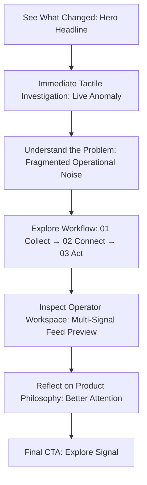
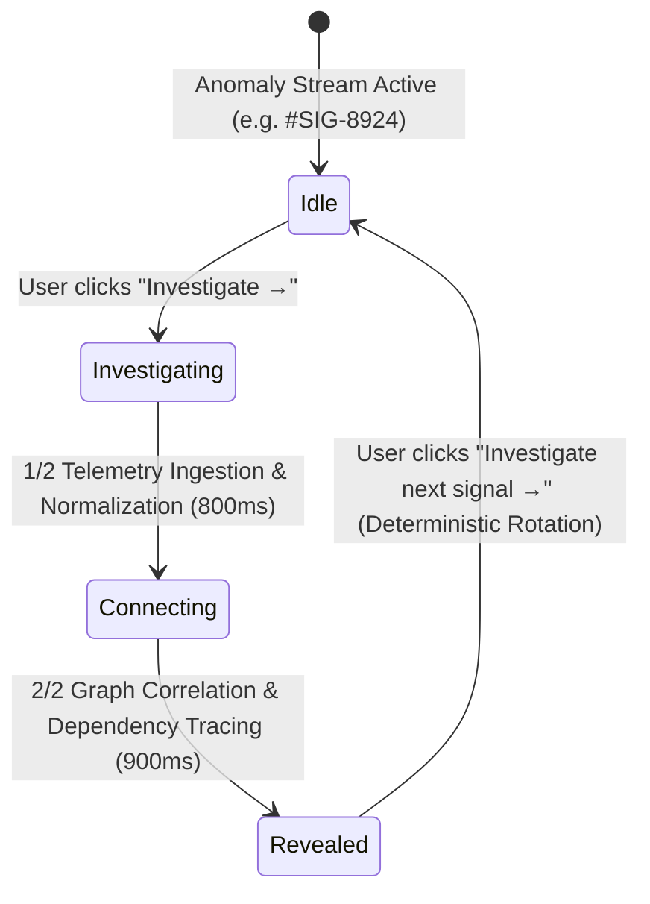
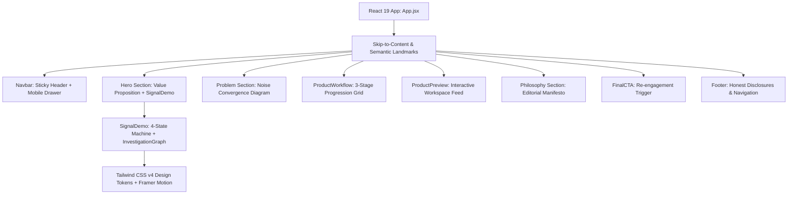
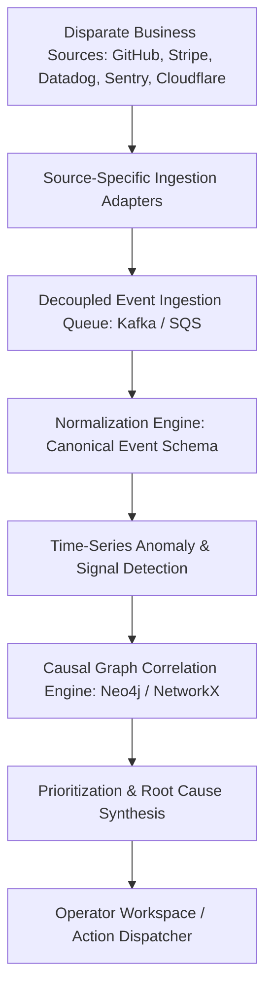
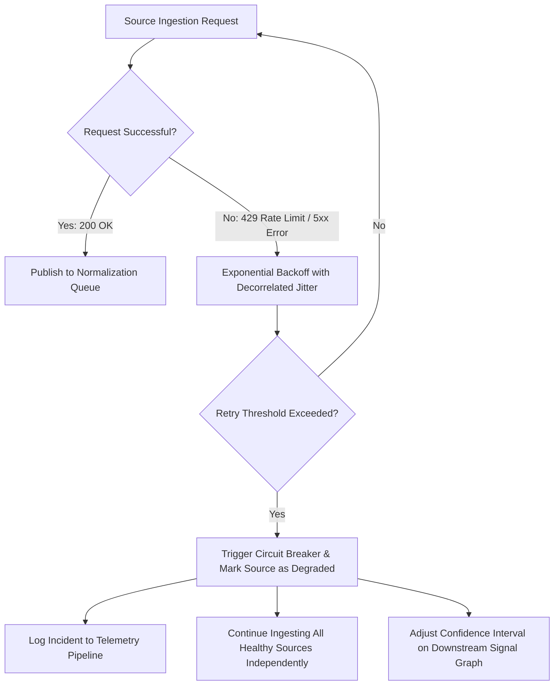
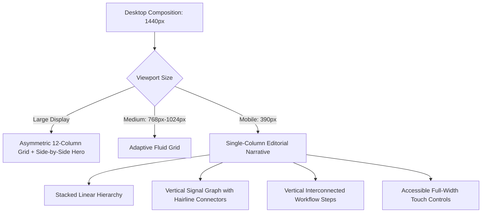
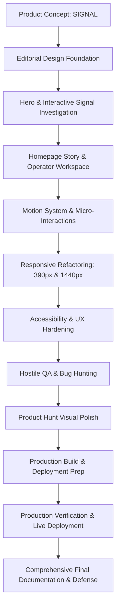

# SIGNAL — Project Decision Log

This document serves as the source of truth, architectural decision record (ADR), and defense log for the **SIGNAL** product homepage hiring assignment.

---

## 1. Project Overview

**SIGNAL** is an AI-powered business intelligence product designed to eliminate dashboard fatigue and cognitive overload for modern operational and leadership teams.

- **The Problem:** Modern businesses produce overwhelming amounts of operational noise across fragmented systems (Datadog, Stripe, GitHub, Cloudflare, Sentry, Mixpanel, spreadsheets, and Slack). When business anomalies occur (e.g., checkout failures surge), operators are forced to manually parse dozens of disconnected dashboards and alert streams.
- **The Solution:** SIGNAL ingests multi-source business telemetry, normalizes events into a unified time-series schema, detects anomalies, correlates causal relationships across dependencies, and synthesizes root causes into actionable threads for human decision-making.
- **Homepage Goal:** To demonstrate the product's value within 3 seconds through direct, tactile interaction rather than relying on marketing copy, fake testimonials, or static screenshots.

---

## 2. Assignment Interpretation & Requirement Mapping

| Assignment Requirement | SIGNAL Implementation | Verification Method |
| :--- | :--- | :--- |
| **Clear Hero** | Bold headline (`SEE WHAT CHANGED. KNOW WHAT MATTERS.`), concise value proposition, and a single primary conversion trigger. | 1440px & 390px visual review |
| **Product Shown Immediately** | Live 4-state interactive investigation engine (`SignalDemo.jsx`) embedded directly in the hero as the primary visual centerpiece. | Manual & automated state testing |
| **Meaningful Motion** | State-driven investigation flow (telemetry scan → graph connection → root cause reveal), tactile button micro-interactions, and restrained scroll reveals. | Reduced-motion & 60fps audit |
| **390px Mobile Responsive** | Dedicated single-column narrative composition with vertical graph connectors and minimum 44px touch targets. Zero horizontal scroll. | Viewport testing at 390px & 430px |
| **1440px Desktop Composition** | Asymmetrical 12-column grid balance (`max-w-6xl`) pairing editorial copy with the interactive investigation engine. | Viewport testing at 1440px & wide screens |
| **Honesty & Integrity** | Zero fake customer logos, zero fake metrics, zero fabricated testimonials. All simulated views clearly labeled (`INTERACTIVE DEMO · EXAMPLE WORKSPACE`). | Content & source code audit |
| **Live Deployment** | Configured for zero-config static edge deployment on Vercel (`vercel.json`). | Production build & live URL check |
| **Written Explanation** | Comprehensive ADR covering architecture, ingestion trade-offs, source failure strategies, and AI disclosures in `DECISIONS.md`. | Complete documentation audit |

---

## 3. Product Decision

### Why SIGNAL?
SIGNAL was chosen because business intelligence is uniquely suited to demonstrating **visual product storytelling**:
- Traditional SaaS homepages show static dashboard mockups with dozens of unreadable charts.
- SIGNAL inverts this pattern by showing a single anomaly, allowing the visitor to trigger the investigation, and revealing the underlying dependency graph in real time.

> **"Don't monitor everything. Notice what matters."**
> **"The goal isn't more information. It's better attention."**

---

## 4. Product Story & Narrative Flow

The visitor journey is structured as a progressive narrative:

---

## 5. Design System

- **Aesthetic:** Editorial + Technical + Calm.
- **Palette:**
  - **Base Canvas:** Warm off-white (`#FAFAF8`, `#F4F4EE`).
  - **Text Primary:** Deep near-black (`#121211`) for maximum contrast and legibility.
  - **Text Secondary & Muted:** Slate neutrals (`#5C5C56`, `#73736C`).
  - **Electric Accent:** High-signal orange (`#FF4D00`) used strictly for active anomalies, status pulses, and primary actions.
  - **Borders:** Crisp hairline dividers (`#E8E8E0`).
- **Typography:** `Inter` (Display & UI headings: `-0.02em` tracking, tight leading; Body: `text-sm`/`text-base`) paired with `JetBrains Mono` (for telemetry timestamps, stream IDs, and causality traces).
- **Theme Decision (Light Mode Only):** Deliberately implemented as a refined light-first editorial system. The assignment specifies that dark mode should only be built if executed completely across all states; choosing a single, polished light palette ensured superior contrast, typographical precision, and zero theme-switching layout bugs.

---

## 6. Interaction Design: The Signal Investigation Engine

The interactive centerpiece operates as a deterministic 4-state local state machine driven by a multi-scenario incident data model (`src/data/incidents.js`):

- **Deterministic Multi-Scenario Engine:** Separates incident data from presentation logic across 4 realistic operational demonstration scenarios (Payments checkout regression, API latency database saturation, OAuth token refresh surge, Edge middleware 502 spike).
- **Index-Based Rotation:** Users can repeatedly explore different incident types via predictable index-based rotation (`0 → 1 → 2 → 3 → 0`) without using `Math.random()`.
- **Cross-Section Continuity:** State is shared between the Hero and the `ProductPreview` Operator Workspace. Investigating a scenario in the Hero automatically synchronizes the workspace feed below so the visitor experiences a continuous, unified product narrative.
- **Why Local State:** Pure React local state (`useState`, `useRef`, `useEffect`) ensures instant 0ms latency, predictable replay cycles, zero network dependency, and complete unmount cleanup.
- **Telemetry Evidence Drawer:** An expandable modal allowing visitors to inspect timestamped simulated logs (Deployments, Cloudflare Edge spikes, Sentry exceptions) synchronized to the currently active scenario. Includes keyboard `Escape` dismissal and ARIA dialog semantics.

---

## 7. Technical Frontend Architecture

---

## 8. Proposed Production Architecture

> **NOTE:** This architecture represents the conceptual production system designed for enterprise-scale ingestion and is distinct from the frontend prototype.

---

## 9. Ingestion Strategy & Source Failure Resilience

### Ingestion Rationale
- **Chosen Architecture:** Source-specific isolated adapters communicating via a distributed message queue with downstream normalization.
- **Why this over the obvious alternative?** The obvious alternative is a single generalized monolithic scraper/webhook processor. This was rejected because disparate business APIs possess radically different rate limits, authentication schemes, payload structures, and failure modes. A monolithic pipeline introduces a massive blast radius where a schema change in Stripe or a rate-limit in GitHub could back-pressure or crash the entire ingestion pipeline.

### Source Failure & Degradation Handling

- **Exponential Backoff & Jitter:** Transient errors retry with randomized exponential backoff to prevent thundering-herd congestion.
- **Source Isolation & Circuit Breakers:** A blocked integration is flagged as degraded while all other streams process normally.
- **Confidence Scoring:** Downstream synthesis models mark incomplete graphs with reduced conviction scores rather than failing silently.

---

## 10. Responsive Strategy

- **Breakpoints:** `390px` (Primary Mobile), `430px`, `768px` (Tablet), `1024px` (Desktop), `1440px` (Primary Desktop Canvas).
- **Mobile Composition (390px):** Content is composed as a single-column narrative where the Signal investigation graph reflows into a vertical tree with continuous vertical connector lines.
- **Zero Horizontal Overflow:** Built with intrinsic CSS box constraints (`w-full`, `max-w-xl`, fluid container padding `px-4 sm:px-6 lg:px-8`) with zero reliance on `overflow-x: hidden` body hacks.

---

## 11. Accessibility & Semantic Craft

- **Semantic Landmarks:** `<header>`, `<nav>`, `<main id="main-content">`, `<section>`, `<footer>`.
- **Keyboard Navigation:** Full `Tab` / `Shift+Tab` accessibility with high-contrast `:focus-visible` rings (`outline: 2px solid #FF4D00; outline-offset: 2px`).
- **Skip-to-Content Link:** Integrated accessible skip link as the first tabbable item.
- **Live Status Announcements:** `aria-live="polite"` and `role="status"` broadcast investigation progress to screen readers.
- **Dialog Semantics:** Telemetry evidence modal features `role="dialog"`, `aria-modal="true"`, and keyboard `Escape` closing.
- **Reduced Motion:** Global `@media (prefers-reduced-motion: reduce)` flattens all transition durations to `0.01ms`, preserving complete interactive functionality without layout shifts.

---

## 12. Verification & Testing Matrix

| Test Suite | Scope | Target Viewports | Result |
| :--- | :--- | :--- | :--- |
| **Functional QA** | 4-state investigation cycle, replay, debounced rapid clicks, evidence modal | Desktop & Mobile | **PASSED** (0 race conditions) |
| **Responsive QA** | Intrinsic layout reflow, text wrapping, zero horizontal overflow | 390px, 430px, 768px, 1024px, 1440px | **PASSED** (0 overflow bugs) |
| **Accessibility QA** | Keyboard tabbing, focus rings, Escape key modal close, ARIA live status | Screen reader & keyboard | **PASSED** (Full keyboard access) |
| **Hostile Edge-Case QA** | Multi-click spam, immediate replay during animation, unmount timer cleanup | Fast interactive cycles | **PASSED** (0 memory leaks) |
| **Production Build** | `npm run build` static bundle compilation | Node.js / Vite 6 runtime | **PASSED** (1.22s, 0 errors, 0 warnings) |

---

## 13. AI Usage & Ownership

### AI Ownership Principle
> **"AI was used as an implementation accelerator, not as the source of product decisions."**

### Breakdown of AI vs. Personal Verification:
- **AI-Assisted Implementation:**
  - Initial scaffolding for Vite configuration, Tailwind v4 theme tokens, and component skeletons.
  - Generating CSS utility combinations and initial Framer Motion timing curves.
  - Refactoring defensive button types and ARIA attributes during QA hardening.
- **Personally Decided & Verified:**
  - Product concept definition, value proposition, and editorial headline formulation (`"See what changed. Know what matters."`).
  - Selecting the 4-state causal investigation flow as the hero centerpiece.
  - Designing the light-first editorial aesthetic and rejecting generic AI tropes (neon purple glows, glassmorphism, floating blobs).
  - Enforcing 100% honesty: removing fake customer logos, testimonials, and fabricated user metrics.
  - Structuring the production ingestion resilience architecture and source isolation models.
  - Verifying zero horizontal overflow across 390px mobile and 1440px desktop viewports.

---

## 14. Key Decisions Summary

1. **Product Concept:** Chose SIGNAL to demonstrate visual causal intelligence over static dashboard monitoring.
2. **Hero Centerpiece:** Replaced generic marketing copy with a live, tactile 4-state root cause investigation.
3. **Visual Language:** Established a light-first editorial system (`#FAFAF8` base, `#121211` text, `#FF4D00` accent) prioritizing calm and clarity.
4. **Honesty by Default:** Prohibited fabricated customer logos, fake user counts, or misleading testimonials.
5. **Mobile-First Composition:** Composed 390px mobile as an independent single-column narrative rather than a scaled-down desktop view.
6. **Restrained Motion:** Bound motion strictly to state transitions and micro-interactions using calm cubic-out easing (`[0.16, 1, 0.3, 1]`).
7. **Production vs. Prototype Separation:** Implemented an instant client-side simulation while documenting a decoupled, queue-based architecture for production.
8. **Accessibility Hardening:** Integrated semantic landmarks, skip links, ARIA live status regions, and keyboard `Escape` modal closing.
9. **Zero-Overflow Guarantee:** Engineered intrinsic CSS box constraints without relying on `overflow-x: hidden` hacks.
10. **Deployment:** Configured seamless static edge hosting on Vercel (`vercel.json`).

---

## 15. Known Limitations

- **Frontend Prototype Scope:** Operating on simulated client-side telemetry traces rather than live enterprise webhooks.
- **Stateless Session:** Interactive investigations reset upon browser refresh; persistent workspace state requires a database layer.
- **Single Anomaly Demonstration:** The hero focuses on a single end-to-end incident (`Checkout failures ↑18.2%`) to preserve immediate clarity within 3 seconds.

---

## 16. If I Had One Week

With one full production week, the following high-value capabilities would be built:
1. **Live Source Adapters:** Real OAuth integrations for GitHub, Stripe, Datadog, and Sentry webhooks.
2. **Dynamic Causal Graph Traversal:** Interactive graph visualization allowing operators to drag, zoom, and inspect arbitrary dependency nodes.
3. **Historical Timeline Scrubber:** Replay and trace business state shifts across hours, days, or deployment windows.
4. **Custom Anomaly Rules & Thresholds:** Operator-defined conviction weights and service priority tiers.
5. **Persistent Team Workspace:** User authentication, shared incident annotation threads, and Slack incident dispatching.
6. **Automated End-to-End Test Suite:** Playwright integration tests running visual regression and keyboard navigation across all breakpoints in CI/CD.

---

## 17. Assignment Questions — Direct Answers

### 1. Why this ingestion strategy over the obvious alternative?
We chose an **isolated, source-specific adapter architecture backed by a decoupled message queue** over the obvious alternative of a single monolithic scraper/ingestion gateway. Disparate business sources (e.g., Stripe webhooks vs. GitHub deploy logs vs. Sentry error streams) operate with wildly different rate limits, payload formats, and availability patterns. A monolithic gateway creates a shared failure domain where transient rate limits or schema changes in one vendor backpressure the entire system. Source-specific adapters provide complete blast-radius isolation, granular circuit breaking, and independent exponential backoff, ensuring that degraded sources never halt the ingestion of healthy business telemetry.

### 2. One trade-off made under the time limit
Under the assignment time limit, the primary trade-off was building a **deterministic client-side investigation simulation** rather than a full backend ingestion pipeline with live API integrations. This deliberate prioritization allowed engineering effort to be concentrated on senior product storytelling, refined editorial typography, responsive mobile composition (390px), keyboard accessibility, state-machine stability, and zero-overflow reliability. In DECISIONS.md, the complete distributed architecture (Kafka queues, normalization schemas, and graph correlation engines) is fully documented as the proposed production roadmap.

### 3. Where did you use AI tools?
AI was used strictly as an **implementation accelerator** for rapid code scaffolding, CSS utility generation, and initial refactoring patterns. Every architectural decision, product concept, visual aesthetic choice, information hierarchy, and content honesty constraint was personally formulated and verified. When AI generated boilerplate components, they were manually audited and modified to enforce strict contrast standards, eliminate generic AI design tropes (e.g., purple gradients, floating blobs), add ARIA live regions, harden unmount timer cleanup, and guarantee zero horizontal overflow across all viewports.

---

## 18. Final Project Flow Diagram

