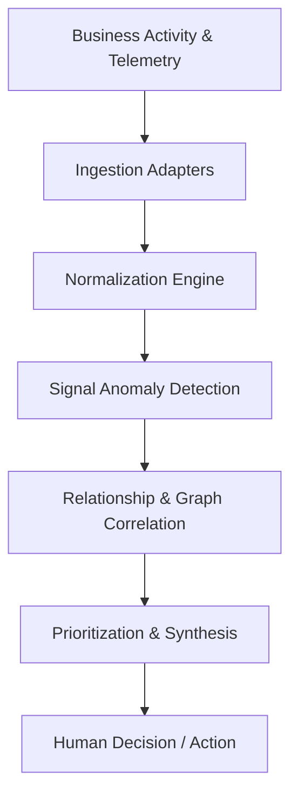
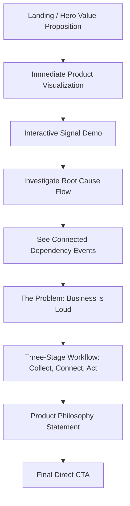
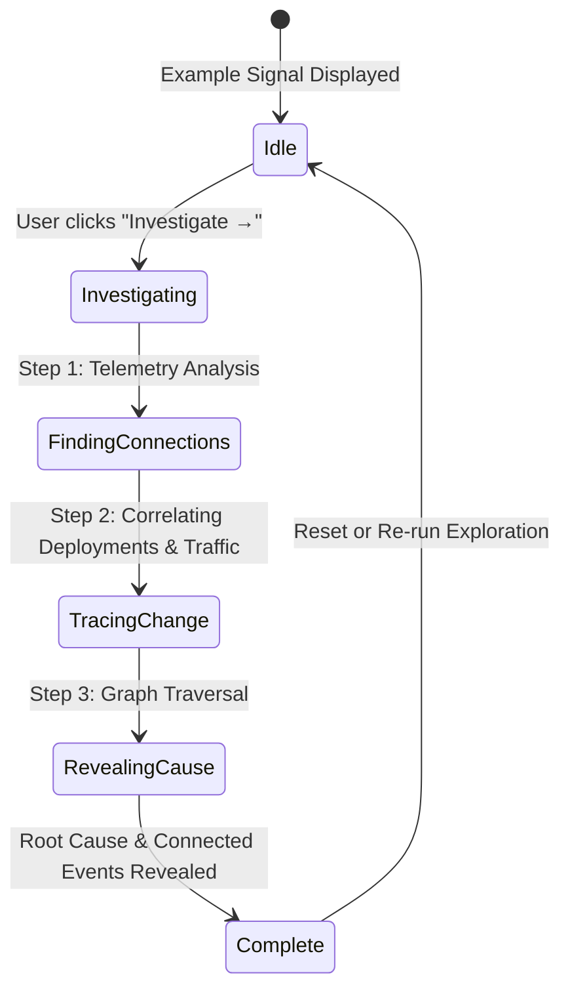
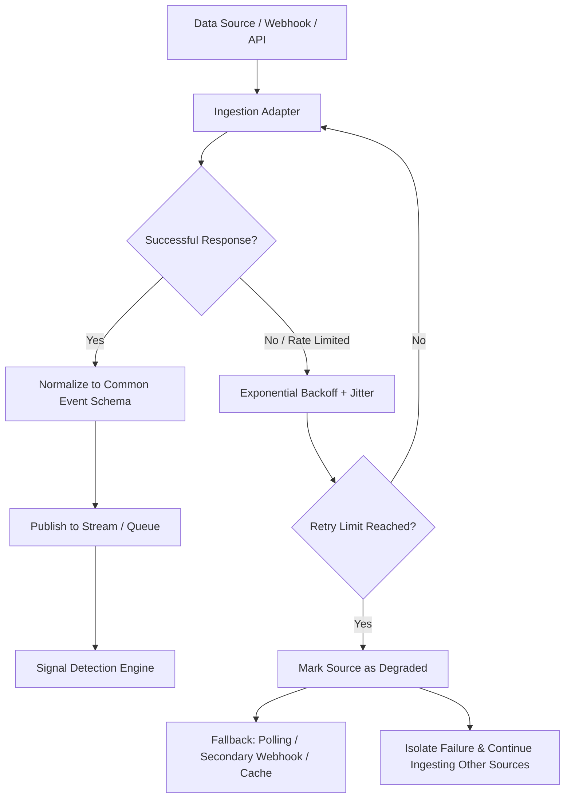

# SIGNAL — Project Decision Log

This document serves as the permanent source of truth and architectural decision record (ADR) for the **SIGNAL** product homepage project. It is updated across each phase to record design rationales, technical decisions, trade-offs, and verification steps.

---

## 1. Product Concept

**SIGNAL** is an AI-powered business intelligence product designed to eliminate dashboard fatigue and cognitive overload for modern operational and leadership teams.

### The Problem
Modern businesses produce overwhelming amounts of operational noise across fragmented tools (Stripe, Datadog, GitHub, Mixpanel, Salesforce, Zendesk, internal databases, spreadsheets). When metrics shift (e.g., checkout conversions drop), teams are forced to manually correlate alerts, dashboards, and release notes to diagnose the root cause.

### The Solution
SIGNAL continuously ingests business events, normalizes unstructured and structured signals, detects anomalies, correlates related cross-functional events, prioritizes critical shifts, and synthesizes root causes into actionable threads for human decision-making.

---

## 2. Product Philosophy

> **"The goal isn't more information. It's better attention."**
> **"Don't monitor everything. Notice what matters."**

SIGNAL rejects the traditional dashboard paradigm of showing hundreds of dials and charts. Instead, it prioritizes high-conviction signals and their causality graphs, empowering operators to act rapidly on what genuinely changed.

---

## 3. Design Direction

- **Aesthetic:** Editorial + Technical + Premium (restrained, intentional, high-contrast clarity).
- **Inspiration:** Minimalist editorial design, precision technical tooling (e.g., Linear, Stripe, Arc), and clean Swiss typography without mimicking specific vendor UI.
- **Palette:**
  - **Base Background:** Warm off-white / very light neutral (`#FAFAF8`, `#F4F4EE`).
  - **Text Primary:** Near-black (`#121211`) for deep contrast and legibility.
  - **Text Secondary & Muted:** Slate neutrals (`#5C5C56`, `#8A8A80`).
  - **Accent:** Single electric signal orange (`#FF4D00`) used strictly for high-value interactive focal points and signal statuses.
  - **Borders & Dividers:** Crisp hairline dividers (`#E8E8E0`, `#D8D8CF`).
- **Typography:** Inter (for clean, legible UI hierarchies) paired with JetBrains Mono (for telemetry, versioning, metrics, and causality traces).
- **Motion Philosophy:** Meaningful, physics-grounded, micro-interactions only. Zero decorative floating blobs, generic gradients, or gratuitous parallax.

---

## 4. Technical Architecture

The conceptual product architecture covers data ingestion through to human decision synthesis:



### Frontend Prototype Stack
- **Framework:** React 19 + Vite 6
- **Styling:** Tailwind CSS v4 + Custom Design Tokens
- **Animation:** Framer Motion (restrained micro-interactions & layout transitions)
- **Icons:** Lucide React
- **Hosting Target:** Vercel (clean, zero-configuration static deployment)

---

## 5. Homepage Flow

The visitor journey is structured to communicate the core value proposition in the first three seconds, immediately providing an interactive demonstration of the investigation flow:



---

## 6. Interactive Demo Flow

The core product demonstration in the Hero/Demo section guides the user through the automated root-cause discovery sequence:



---

## 7. Ingestion Strategy

### Implemented in Prototype vs. Proposed Production Architecture
- **Implemented in Prototype:** Fully client-side, instant, deterministic simulation using realistic mock event traces (Checkout failures, Release 2.4.1, Payment API latency, Mobile traffic spikes). Clearly labeled as *"Interactive demo · Example workspace"*.
- **Proposed Production Architecture:** A resilient, decoupled event-driven ingestion pipeline designed to withstand API rate limits, provider outages, and blocking:



#### Production Ingestion Resilience Pillars:
1. **Source Isolation:** Every integration runs in an isolated worker sandbox with independent circuit breakers. A failure in GitHub or Stripe never impairs Datadog or Salesforce ingestion.
2. **Exponential Backoff & Jitter:** Transient 429s and 5xx errors automatically retry with decorrelated jitter to prevent thundering herds.
3. **Graceful Degradation:** When an upstream integration is unavailable, the system flags the signal confidence interval rather than crashing the investigation engine.
4. **Alternative Ingestion Vectors:** Support dual ingestion routes (e.g., push webhooks with automated fallback to scheduled read-only polling).

---

## 8. Decisions Made Per Phase

### Phase 0 — Project Initialization and Foundation
- **Date:** 2026-08-18
- **Decision:** Initialized a minimalist React 19 + Vite 6 application with Tailwind CSS v4, Framer Motion, and Lucide React. Configured warm editorial design tokens and typography hierarchy.
- **Why:** Delivers an ultra-fast, zero-overhead development setup with high visual fidelity, complete type safety in styling, and performant motion primitives without heavy runtime dependencies.
- **Alternative Considered:** Next.js (App Router) or plain Vanilla JS.
- **Why Rejected:** Next.js introduces unnecessary server complexity, SSR configuration, and deployment overhead for what is strictly an interactive frontend showcase. Plain Vanilla JS lacks declarative state transitions needed for the step-by-step investigation animation.
- **Trade-off:** Client-side only rendering, perfectly matched to the static Vercel deployment requirement.
- **Verification:** Verified package.json dependencies, Vite configuration, index.html font loading, Tailwind CSS v4 styling rules, and clean startup.
- **Current Status:** Completed.

### Phase 1 — Design Foundation
- **Date:** 2026-08-18
- **Decision:** Established a light-first editorial design foundation, centralized design tokens (`--bg-base: #FAFAF8`, `--text-primary: #121211`, `--accent-signal: #FF4D00`), typography hierarchy (`Inter` + `JetBrains Mono`), reusable component primitives (`Container`, `Button`, `Badge`, `Card`, `SectionHeading`, `Navbar`, `Footer`), and motion presets in `src/utils/motion.js`.
- **Why:** SIGNAL requires a calm, authoritative, and technical aesthetic. Relying on warm editorial neutrals and an electric signal orange accent creates an immediate perception of high engineering craft without relying on generic SaaS tropes.
- **Alternatives Considered & Rejected:**
  1. *Dark-first UI / Toggle:* Rejected because the assignment explicitly mandates that dark mode must only be built if fully supported across the entire product. A disciplined light-first editorial system is more distinctive and reliable.
  2. *Purple/Indigo AI Gradients & Glassmorphism:* Rejected as generic AI cliches that degrade trust for serious data intelligence tools.
  3. *Card-heavy Dashboard Grid:* Rejected in favor of generous whitespace and typography-led layouts where elements sit directly on the canvas.
- **Design System Overview:**
  - **Colors:** Warm light base (`#FAFAF8`), subtle surface (`#F4F4EE`), crisp card surface (`#FFFFFF`), primary text (`#121211`), secondary muted text (`#5C5C56`), electric accent (`#FF4D00`).
  - **Typography:** Inter (Display & Headings: `-0.02em` tracking, tight leading; Body: `text-sm`/`text-base`) paired with JetBrains Mono for telemetry, metrics, and causality codes.
  - **Spacing & Containers:** Centered layout (`max-w-5xl`, `max-w-6xl`) with responsive padding (`px-4 sm:px-6 lg:px-8`) ensuring no horizontal overflow on viewports down to 390px.
  - **Cards & Borders:** Hairline borders (`#E8E8E0`), subtle elevation (`shadow-xs`), controlled radius (`rounded-lg`), subtle interactive hover states.
  - **Buttons:** High-contrast `primary` (solid near-black `#121211`), `accent` (electric `#FF4D00`), `secondary` (bordered), and `ghost` with accessible `:focus-visible` rings.
  - **Navbar:** Sticky header with SIGNAL logomark, responsive mobile drawer toggle, desktop nav links, and primary CTA.
  - **Footer:** Minimalist structural footer with demo disclaimer and attribution.
- **Motion Principles:**
  - Easing: `[0.16, 1, 0.3, 1]` (cubic-out for crisp editorial snappiness).
  - Durations: `100ms` (instant), `200ms` (micro-interactions), `350ms` (component transitions).
  - `prefers-reduced-motion` strictly honored via global CSS and Framer Motion conventions.
- **Trade-offs:** Intentionally deferred complex interactive animations and full hero composition to subsequent dedicated phases to ensure rock-solid foundational stability.
- **Verification:**
  - Dev server running smoothly on `http://localhost:3000/`.
  - Production build (`npm run build`) passed with zero errors/warnings in 832ms.
  - Console checked: Zero errors and zero warnings.
  - Browser subagent verification: Tested at 1440px desktop width and 390px/500px mobile widths. Mobile drawer opens/closes cleanly, button hover states work, no horizontal scrollbars exist.
- **Current Status:** Phase 1: COMPLETE. Ready for Phase 2.

```mermaid
flowchart TD
    A[SIGNAL Visual Identity]
    A --> B[Typography: Inter + JetBrains Mono]
    A --> C[Color: Warm Light-First + Electric Orange #FF4D00]
    A --> D[Spacing: Generous Whitespace & Fluid Grid]
    A --> E[Component Primitives]
    A --> F[Motion: Crisp [0.16, 1, 0.3, 1] Transitions]
    A --> G[Responsive Rules: 390px to 1440px Zero-Overflow]

    E --> H[Navbar & Mobile Drawer]
    E --> I[Buttons: Primary, Accent, Secondary, Ghost]
    E --> J[Cards: Restrained Borders & Subtle Elevation]
    E --> K[Badges: Pulsing Signal & Status Tags]
    E --> L[SectionHeading & Container]
    E --> M[Footer: Minimal & Honest Disclosures]
```

---

## 9. AI Usage

- **Phase 0:**
  - *AI Generated:* Scaffolding for `package.json`, `vite.config.js`, `index.html`, `src/index.css`, `DECISIONS.md`, and `README.md`.
  - *Manually Reviewed & Tuned:* Warm off-white color tokens and Vite Tailwind v4 integration.
  - *Tested:* Initial build and dev server launch.
- **Phase 1:**
  - *AI Implemented:* Centralized Tailwind v4 theme tokens in `src/index.css`, motion presets in `src/utils/motion.js`, component primitives (`Container.jsx`, `Button.jsx`, `Badge.jsx`, `Card.jsx`, `SectionHeading.jsx`, `Navbar.jsx`, `Footer.jsx`), and the Phase 1 Design Foundation showcase in `App.jsx`.
  - *Manually Reviewed & Tuned:* Removed `overflow-x: hidden` to guarantee authentic structural zero-overflow; verified focus-visible styling for accessibility; adjusted mobile drawer toggle mechanics.
  - *Tested:* Automated browser subagent visual inspection at 1440px and mobile widths, hover states, console logs, and Vite production bundle compilation.

---

## 10. Known Issues

*None.* All foundation components and layout constraints verified cleanly.

---

## 11. Future Improvements

- Sound design / haptic audio feedback on signal investigation resolution (optional subtle click).
- Keyboard navigation shortcuts (e.g., `Space` / `Enter` to step through investigation stages).
- Interactive timeline scrubber to inspect signals over arbitrary time windows.

