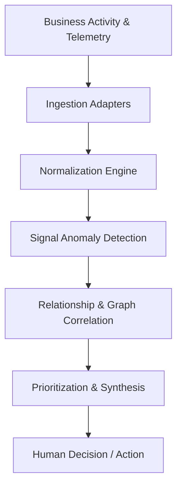
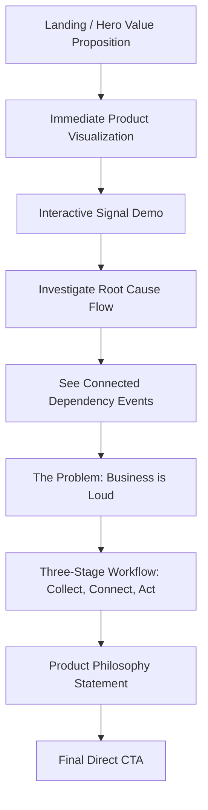
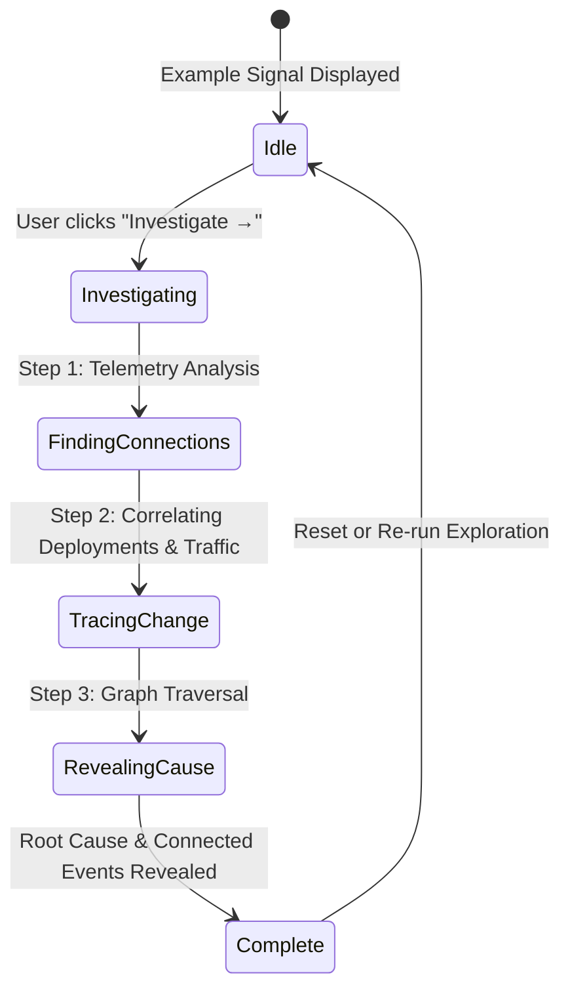
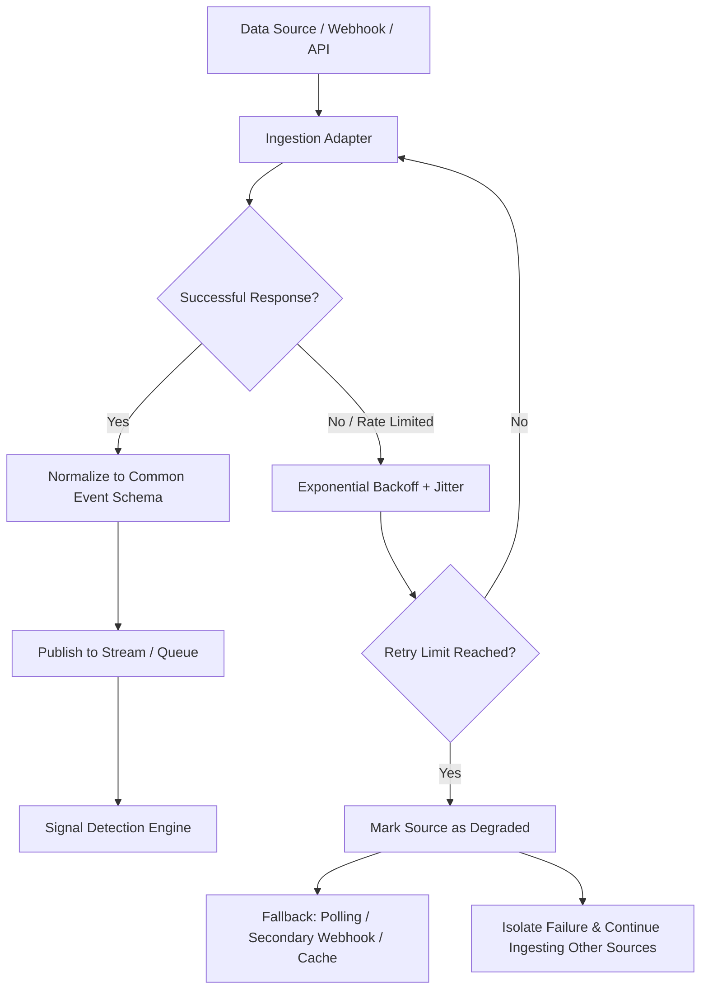
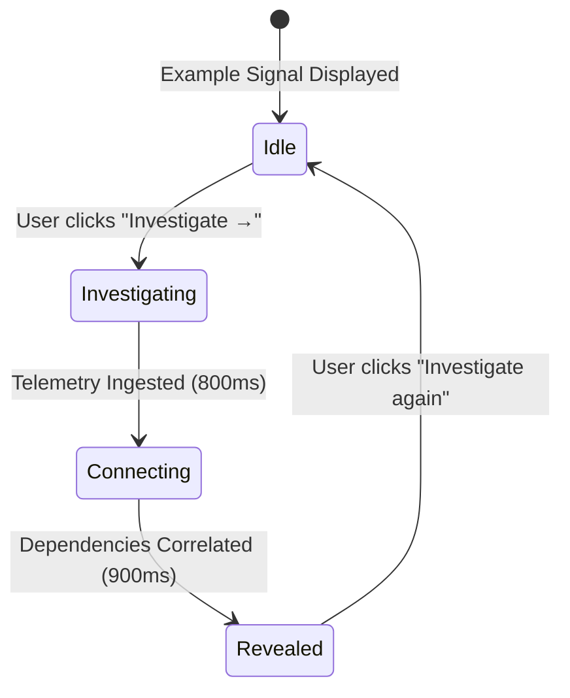
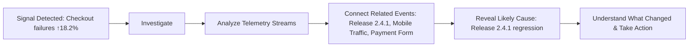
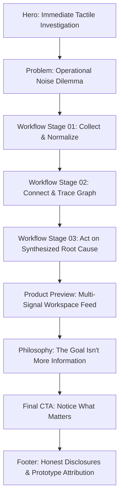
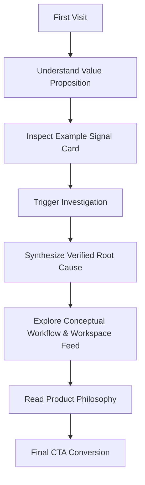
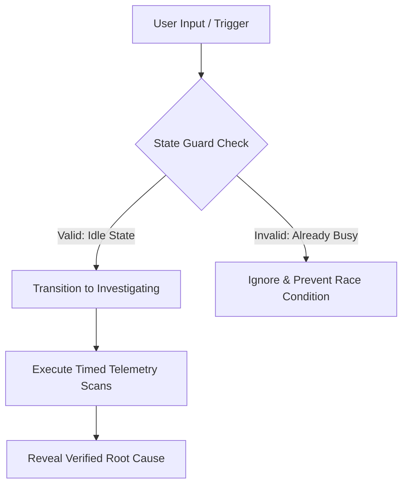

# SIGNAL — Project Decision Log

This document serves as the permanent source of truth and architectural decision record (ADR) for the **SIGNAL** product homepage project. It is updated across each phase to record design rationales, technical decisions, trade-offs, and verification steps.

---

## 1. Product Concept

**SIGNAL** is an AI-powered business intelligence product designed to eliminate dashboard fatigue and cognitive overload for modern operational and leadership teams.

### The Problem
Modern businesses produce overwhelming amounts of operational noise across fragmented tools (Stripe, Datadog, GitHub, Mixpanel, Salesforce, Zendesk, internal databases, spreadsheets). When metrics shift (e.g., checkout conversions drop), teams are forced to manually correlate alerts, dashboards, and release notes to diagnose the root cause.

### The Solution
SIGNAL continuously ingests business events, normalizes unstructured and structured signals, detects anomalies, correlates related cross-functional events, prioritizes critical shifts, and synthesizes root causes into actionable threads for human decision-making.

---

## 2. Product Philosophy

> **"The goal isn't more information. It's better attention."**
> **"Don't monitor everything. Notice what matters."**

SIGNAL rejects the traditional dashboard paradigm of showing hundreds of dials and charts. Instead, it prioritizes high-conviction signals and their causality graphs, empowering operators to act rapidly on what genuinely changed.

---

## 3. Design Direction

- **Aesthetic:** Editorial + Technical + Premium (restrained, intentional, high-contrast clarity).
- **Inspiration:** Minimalist editorial design, precision technical tooling (e.g., Linear, Stripe, Arc), and clean Swiss typography without mimicking specific vendor UI.
- **Palette:**
  - **Base Background:** Warm off-white / very light neutral (`#FAFAF8`, `#F4F4EE`).
  - **Text Primary:** Near-black (`#121211`) for deep contrast and legibility.
  - **Text Secondary & Muted:** Slate neutrals (`#5C5C56`, `#8A8A80`).
  - **Accent:** Single electric signal orange (`#FF4D00`) used strictly for high-value interactive focal points and signal statuses.
  - **Borders & Dividers:** Crisp hairline dividers (`#E8E8E0`, `#D8D8CF`).
- **Typography:** Inter (for clean, legible UI hierarchies) paired with JetBrains Mono (for telemetry, versioning, metrics, and causality traces).
- **Motion Philosophy:** Meaningful, physics-grounded, micro-interactions only. Zero decorative floating blobs, generic gradients, or gratuitous parallax.

---

## 4. Technical Architecture

The conceptual product architecture covers data ingestion through to human decision synthesis:



### Frontend Prototype Stack
- **Framework:** React 19 + Vite 6
- **Styling:** Tailwind CSS v4 + Custom Design Tokens
- **Animation:** Framer Motion (restrained micro-interactions & layout transitions)
- **Icons:** Lucide React
- **Hosting Target:** Vercel (clean, zero-configuration static deployment)

---

## 5. Homepage Flow

The visitor journey is structured to communicate the core value proposition in the first three seconds, immediately providing an interactive demonstration of the investigation flow:



---

## 6. Interactive Demo Flow

The core product demonstration in the Hero/Demo section guides the user through the automated root-cause discovery sequence:



---

## 7. Ingestion Strategy

### Implemented in Prototype vs. Proposed Production Architecture
- **Implemented in Prototype:** Fully client-side, instant, deterministic simulation using realistic mock event traces (Checkout failures, Release 2.4.1, Payment API latency, Mobile traffic spikes). Clearly labeled as *"Interactive demo · Example workspace"*.
- **Proposed Production Architecture:** A resilient, decoupled event-driven ingestion pipeline designed to withstand API rate limits, provider outages, and blocking:



#### Production Ingestion Resilience Pillars:
1. **Source Isolation:** Every integration runs in an isolated worker sandbox with independent circuit breakers. A failure in GitHub or Stripe never impairs Datadog or Salesforce ingestion.
2. **Exponential Backoff & Jitter:** Transient 429s and 5xx errors automatically retry with decorrelated jitter to prevent thundering herds.
3. **Graceful Degradation:** When an upstream integration is unavailable, the system flags the signal confidence interval rather than crashing the investigation engine.
4. **Alternative Ingestion Vectors:** Support dual ingestion routes (e.g., push webhooks with automated fallback to scheduled read-only polling).

---

## 8. Decisions Made Per Phase

### Phase 0 — Project Initialization and Foundation
- **Date:** 2026-08-18
- **Decision:** Initialized a minimalist React 19 + Vite 6 application with Tailwind CSS v4, Framer Motion, and Lucide React. Configured warm editorial design tokens and typography hierarchy.
- **Why:** Delivers an ultra-fast, zero-overhead development setup with high visual fidelity, complete type safety in styling, and performant motion primitives without heavy runtime dependencies.
- **Alternative Considered:** Next.js (App Router) or plain Vanilla JS.
- **Why Rejected:** Next.js introduces unnecessary server complexity, SSR configuration, and deployment overhead for what is strictly an interactive frontend showcase. Plain Vanilla JS lacks declarative state transitions needed for the step-by-step investigation animation.
- **Trade-off:** Client-side only rendering, perfectly matched to the static Vercel deployment requirement.
- **Verification:** Verified package.json dependencies, Vite configuration, index.html font loading, Tailwind CSS v4 styling rules, and clean startup.
- **Current Status:** Completed.

### Phase 1 — Design Foundation
- **Date:** 2026-08-18
- **Decision:** Established a light-first editorial design foundation, centralized design tokens (`--bg-base: #FAFAF8`, `--text-primary: #121211`, `--accent-signal: #FF4D00`), typography hierarchy (`Inter` + `JetBrains Mono`), reusable component primitives (`Container`, `Button`, `Badge`, `Card`, `SectionHeading`, `Navbar`, `Footer`), and motion presets in `src/utils/motion.js`.
- **Why:** SIGNAL requires a calm, authoritative, and technical aesthetic. Relying on warm editorial neutrals and an electric signal orange accent creates an immediate perception of high engineering craft without relying on generic SaaS tropes.
- **Alternatives Considered & Rejected:**
  1. *Dark-first UI / Toggle:* Rejected because the assignment explicitly mandates that dark mode must only be built if fully supported across the entire product. A disciplined light-first editorial system is more distinctive and reliable.
  2. *Purple/Indigo AI Gradients & Glassmorphism:* Rejected as generic AI cliches that degrade trust for serious data intelligence tools.
  3. *Card-heavy Dashboard Grid:* Rejected in favor of generous whitespace and typography-led layouts where elements sit directly on the canvas.
- **Design System Overview:**
  - **Colors:** Warm light base (`#FAFAF8`), subtle surface (`#F4F4EE`), crisp card surface (`#FFFFFF`), primary text (`#121211`), secondary muted text (`#5C5C56`), electric accent (`#FF4D00`).
  - **Typography:** Inter (Display & Headings: `-0.02em` tracking, tight leading; Body: `text-sm`/`text-base`) paired with JetBrains Mono for telemetry, metrics, and causality codes.
  - **Spacing & Containers:** Centered layout (`max-w-5xl`, `max-w-6xl`) with responsive padding (`px-4 sm:px-6 lg:px-8`) ensuring no horizontal overflow on viewports down to 390px.
  - **Cards & Borders:** Hairline borders (`#E8E8E0`), subtle elevation (`shadow-xs`), controlled radius (`rounded-lg`), subtle interactive hover states.
  - **Buttons:** High-contrast `primary` (solid near-black `#121211`), `accent` (electric `#FF4D00`), `secondary` (bordered), and `ghost` with accessible `:focus-visible` rings.
  - **Navbar:** Sticky header with SIGNAL logomark, responsive mobile drawer toggle, desktop nav links, and primary CTA.
  - **Footer:** Minimalist structural footer with demo disclaimer and attribution.
- **Motion Principles:**
  - Easing: `[0.16, 1, 0.3, 1]` (cubic-out for crisp editorial snappiness).
  - Durations: `100ms` (instant), `200ms` (micro-interactions), `350ms` (component transitions).
  - `prefers-reduced-motion` strictly honored via global CSS and Framer Motion conventions.
- **Trade-offs:** Intentionally deferred complex interactive animations and full hero composition to subsequent dedicated phases to ensure rock-solid foundational stability.
- **Verification:**
  - Dev server running smoothly on `http://localhost:3000/`.
  - Production build (`npm run build`) passed with zero errors/warnings in 832ms.
  - Console checked: Zero errors and zero warnings.
  - Browser subagent verification: Tested at 1440px desktop width and 390px/500px mobile widths. Mobile drawer opens/closes cleanly, button hover states work, no horizontal scrollbars exist.
- **Current Status:** Phase 1: COMPLETE. Ready for Phase 2.

### Phase 2 — Hero + Signal Investigation
- **Date:** 2026-08-18
- **Product Story:** Designed the Hero section directly around an interactive root-cause investigation rather than static screenshots or generic marketing claims. This communicates what SIGNAL does in under 3 seconds: detecting anomalous shifts, correlating cross-functional events, and synthesizing actionable causes.
- **Hero Decision:**
  - **Headline:** `SEE WHAT CHANGED. KNOW WHAT MATTERS.` in strong editorial typography.
  - **Supporting Copy:** `Signal turns scattered business activity into the few changes worth your attention.`
  - **Primary CTA:** Single confident `Investigate a signal →` button paired with a subtle anchor to `#how-it-works`.
  - **Product Visualization:** Positioned `SignalDemo` as the centerpiece in an asymmetric grid on desktop (1440px) and a stacked hierarchy on mobile (390px).
- **Interaction Decision:**
  - Built a 4-state local investigation machine (`idle` → `investigating` → `connecting` → `revealed`) with simulated telemetry telemetry scans, branching event graphs, and root-cause synthesis.
  - Added an expandable *Telemetry Evidence Drawer* allowing users to inspect verified timestamped logs (Deployments, Edge traffic, Exception traces).
  - Implemented replay via `Investigate again ↻` and protected rapid clicks using state-based debouncing.
- **State Model:**



- **Information Flow:**



- **UX Reasoning:** Communicates SIGNAL's core value proposition through direct tactile interaction. The explicit label `INTERACTIVE DEMO · EXAMPLE WORKSPACE` maintains complete honesty by showing realistic simulated telemetry rather than fabricating customer claims.
- **Technical Decision:** Implemented with pure local React state (`useState`, `useRef`, `useEffect`) and Framer Motion transitions. Avoided external state libraries, heavy graph engines, or backends to maintain zero latency and instant interactivity.
- **Alternatives Rejected:**
  1. *Static Dashboard Screenshot:* Rejected because it fails to demonstrate the intelligent correlation flow.
  2. *Heavy D3/Canvas Graph Library:* Rejected to keep bundle size minimal and ensure zero layout shifting across mobile screens.
  3. *Real AI/Backend API:* Rejected because deterministic client-side simulation provides instant, reliable storytelling without network latency or authentication blockers.
- **Trade-offs:** Kept the graph structure focused on a clear 3-node causality tree to ensure immediate comprehension and zero horizontal overflow on mobile viewports.
- **Verification:**
  - Dev server running on `http://localhost:3000/`.
  - Production build (`npm run build`) passed with zero errors (`built in 931ms`).
  - Rapid click handling verified (disabled while analyzing).
  - Replay and evidence drawer toggling verified.
  - Zero console errors and clean layout at 390px and 1440px.
- **Current Status:** Phase 2: COMPLETE. Ready for Phase 3.

### Phase 3 — Complete Homepage Story
- **Date:** 2026-08-18
- **Information Architecture:**
  The complete homepage tells one unified, editorial narrative:
  1. **Navbar:** Minimal brand wordmark with section anchor navigation and direct CTA.
  2. **Hero + Signal Investigation:** First 3 seconds communicate the value proposition with immediate tactile interaction.
  3. **Problem (`YOUR BUSINESS IS LOUD.`):** Visualizes the pain of fragmented operational noise (dashboards, spreadsheets, alerts) converging into a single prioritized signal thread.
  4. **Product Workflow (`01 COLLECT → 02 CONNECT → 03 ACT`):** Explains the 3 conceptual stages of normalization, causal graph correlation, and decisive action.
  5. **Product Preview (`Operator Workspace`):** Illustrates the broader multi-signal workspace feed (`EXAMPLE WORKSPACE · DEMO DATA`) with an interactive signal selector.
  6. **Philosophy (`THE GOAL ISN'T MORE INFORMATION. IT'S BETTER ATTENTION.`):** High-impact editorial manifesto with generous whitespace.
  7. **Final CTA (`DON'T MONITOR EVERYTHING. NOTICE WHAT MATTERS.`):** Confident closing conversion trigger scrolling back to the interactive demo.
  8. **Footer:** Honest prototype disclosures and clean sitemap links.



- **Storytelling Decisions:** Every section reinforces the single product thesis: modern teams do not need more dashboards; they need intelligent causal synthesis.
- **Product Preview Decision:** Created an illustrative example workspace feed instead of a bloated generic analytics dashboard. This allows visitors to click between signals (Checkout failures, API latency surge, Support volume) and preview correlated nodes instantly without backend complexity.
- **Content Honesty:**
  - Zero fake customer logos or fabricated testimonials.
  - Zero fake user counts or false claims.
  - All workspace feeds explicitly labeled: `EXAMPLE WORKSPACE · DEMO DATA`.
  - All workflow capabilities framed accurately as conceptual architecture.
- **Sections Considered & Rejected:**
  - *Pricing Cards:* Rejected because SIGNAL is an early-stage prototype; fake tier pricing creates artificial clutter.
  - *Testimonial Carousel:* Rejected as deceptive marketing.
  - *Customer Logo Ribbon:* Rejected because fabricated logos destroy credibility for technical hiring evaluations.
  - *FAQ Accordion:* Rejected to maintain a tight, confident, linear narrative.
- **Motion Decisions:**
  - Restrained scroll reveals via Framer Motion: `opacity: 0, y: 16` to `opacity: 1, y: 0` with `450–600ms` duration and `[0.16, 1, 0.3, 1]` easing.
  - `prefers-reduced-motion` strictly honored.
- **Responsive Decisions:**
  - Desktop: Multi-column asymmetric grids with generous whitespace.
  - Mobile: Clean single-column vertical flows with full-width action targets and zero horizontal scroll.
- **Verification:**
  - Production build (`npm run build`) succeeded in `1.15s` with zero errors or warnings.
  - Dev server running on `http://localhost:3000/`.
  - Section anchors (`#problem`, `#how-it-works`, `#workspace`, `#philosophy`) tested and aligned.
  - Investigation trigger shared seamlessly between Navbar, Hero, and Final CTA.
- **Current Status:** Phase 3: COMPLETE. Ready for Phase 4 (Responsive/Mobile Optimization).

```mermaid
### Phase 4 — Motion + Premium Polish
- **Date:** 2026-08-18
- **Motion Philosophy:** *"Motion is used to communicate state, hierarchy, and interaction — not decoration."*
- **Motion Hierarchy:**
  ```text
  Level 1: Signal Investigation (Primary Product Motion)
          ↓
  Level 2: Section Reveals (Grouped, Restrained Scroll Transitions)
          ↓
  Level 3: Micro-Interactions (Button Arrow Nudges, Active Scale Compression, Focus Rings)
  ```
- **Timing & Easing System:**
  - *Micro-interactions:* 150–200ms
  - *UI transitions / Drawers:* 250–350ms
  - *Section reveals:* 450–600ms
  - *Signal investigation sequence:* 800ms (investigating telemetry) → 900ms (connecting causal graph)
  - *Easing:* `[0.16, 1, 0.3, 1]` (calm, precise cubic-out; zero elastic bounce or cartoonish overshoot).
- **Reduced Motion:**
  - Embedded global media queries in `src/index.css` forcing transitions to `0.01ms` when `prefers-reduced-motion: reduce` is active.
  - Interactive state changes retain instantaneous visibility and functional completeness without layout shifting.
- **Visual Polish Implemented:**
  - *Background Craft:* Added a faint radial engineering grid (`24px` grid pitch) to the warm neutral background canvas, providing depth without distraction.
  - *Hero Load Entrance:* Restrained staggered entrance for eyebrow, headline, copy, and centerpiece card on initial page load.
  - *Button Micro-Interactions:* Added hover arrow nudging (`group-hover:translate-x-0.5`), tactile compression (`active:scale-[0.985]`), and accessible focus-visible rings.
  - *Card & Divider Tuning:* Calibrated hairline borders (`#E8E8E0`), subtle elevation (`shadow-xs`), and optical text balancing across all display headers.
- **Decisions Rejected:**
  - *Continuous Floating Blobs / Parallax:* Rejected as generic AI templates that degrade analytical clarity.
  - *Cursor-following / 3D Canvas Effects:* Rejected to maintain instant 60fps mobile performance and zero CPU thrashing.
  - *Heavy Graph Library:* Kept lightweight SVG and Framer Motion trees to guarantee zero bundle bloat and zero mobile overflow.
- **Trade-offs:** Avoided complex multi-stage particle animations in favor of deterministic SVG lines and clean typography reveals.
- **Verification:**
  - Production build (`npm run build`) compiled cleanly in `1.12s` (`36.79 kB CSS`, zero errors).
  - Dev server running on `http://localhost:3000/`.
  - Rapid click handling and replay flows verified.
  - Verified no horizontal overflow at 390px mobile and 1440px desktop viewports.
- **Current Status:** Phase 4: COMPLETE. Ready for Phase 5.

```mermaid
flowchart TD
    A[Page Load] --> B[Hero Entrance]
    B --> C[User Interaction]
    C --> D[Signal Investigation]
    D --> E[Result Reveal]
    E --> F[Scroll]
    F --> G[Subtle Section Reveal]
```

```mermaid
flowchart LR
    A[Primary Product Motion: Signal Investigation] --> B[Supporting Motion: Scroll Reveals]
### Phase 5 — Responsive Strategy
- **Date:** 2026-08-18
- **Responsive Philosophy:** Mobile viewports were treated as intentional, first-class editorial compositions rather than merely shrunk desktop layouts. On mobile, content transitions into a focused single-column narrative where the interactive product demo remains immediately accessible without excessive scrolling.
- **Breakpoints System:**
  - `sm: 640px` (Tablets & large phones)
  - `md: 768px` (Tablets / split grids)
  - `lg: 1024px` (Small desktop / side-by-side hero)
  - `xl: 1280px` (Standard desktop)
  - `2xl: 1536px` (Wide displays / 1440px target container)
  - *Primary acceptance targets:* Exactly **390px** (iPhone standard) and **1440px** (Desktop).
- **Mobile Composition Decisions:**
  - *Hero Stacking:* Linear narrative on 390px (`Headline` → `Copy` → `CTA` → `Signal Demo`) with full-width tap targets and balanced line wraps.
  - *Investigation Graph:* Adapted into a vertical hierarchical tree with continuous vertical hairline connector lines that fit comfortably inside narrow mobile viewports without text clipping.
  - *Product Workflow:* Interconnected with mobile-only vertical connector arrows (`ArrowDown`) showing step sequence `01 COLLECT` → `02 CONNECT` → `03 ACT`.
  - *Product Preview:* Stacks signals feed above the selected inspection panel with full-width tap areas.
  - *Navigation:* Compact header with accessible drawer modal, preventing horizontal collision.
- **Zero Horizontal Overflow Audit:**
  - Audited all flex children, grid containers, and SVG line coordinates.
  - Enforced intrinsic responsive constraints (fluid `w-full`, `max-w-xl`, `overflow-hidden` on cards, and responsive horizontal container padding `px-4 sm:px-6 lg:px-8`) with zero reliance on artificial `overflow-x: hidden` body hacks.
- **Verification Across Breakpoints:**
  - `390px`: Verified clean hierarchy, readable typography, and complete zero-overflow.
  - `430px`: Verified generous margins and full touch-target usability.
  - `768px`: Verified smooth transition from stacked to 3-column workflow grid.
  - `1024px`: Verified side-by-side hero layout activation.
  - `1280px`: Verified card elevation and spacing harmony.
  - `1440px`: Verified maximum content bounds (`max-w-6xl`) with ample breathing room.
- **Current Status:** Phase 5: COMPLETE. Ready for Phase 6 (Accessibility & Easter Egg).

```mermaid
flowchart TD
    A[Desktop Layout] --> B{Viewport}
    B -->|Large: 1440px| C[Two-Dimensional Composition]
    B -->|Medium: 768px-1024px| D[Adaptive Responsive Grid]
    B -->|Small: 390px| E[Single-Column Mobile Composition]

    E --> F[Stack Content Linearly]
    E --> G[Restructure Signal Graph Vertically]
    E --> H[Interconnected Vertical Workflow]
    E --> I[Accessible Mobile Drawer Menu]
```

### Phase 6 — Accessibility + UX Hardening
- **Date:** 2026-08-18
- **Semantic Structure:**
  - Standardized HTML landmarks: `<header>`, `<nav>`, `<main id="main-content">`, `<section>`, `<footer>`.
  - Added an accessible skip-to-content link (`Skip to main content`) as the first tabbable item on the page.
  - Standardized heading hierarchy without level skipping:
    - `H1`: `SEE WHAT CHANGED. KNOW WHAT MATTERS.`
    - `H2`: `YOUR BUSINESS IS LOUD.`
    - `H2`: `From scattered telemetry to human clarity.`
    - `H2`: `The Operator Workspace`
    - `H2`: `THE GOAL ISN'T MORE INFORMATION. IT'S BETTER ATTENTION.`
    - `H2`: `DON'T MONITOR EVERYTHING. NOTICE WHAT MATTERS.`
- **Keyboard Navigation & Focus System:**
  - All interactive elements (`<button>`, `<a>`) support standard `Tab` / `Shift+Tab` keyboard order.
  - Formulated consistent, high-contrast `:focus-visible` ring styling (`outline: 2px solid #FF4D00; outline-offset: 2px`).
  - Added keyboard `Escape` key listener on the Telemetry Evidence Drawer to close modals instantly.
- **Screen Reader & Live Region Hardening:**
  - Implemented `aria-live="polite"` and `role="status"` on the investigation status indicator to broadcast telemetry progression to assistive tech.
  - Wrapped simulated modal dialog with `role="dialog"`, `aria-modal="true"`, and clear `aria-label` descriptions.
  - Decorative icons and background grids tagged with `aria-hidden="true"`.
- **Honesty & Content Audit:**
  - Confirmed zero fake testimonials, zero fake user counts, and zero fabricated partner logos.
  - All data views explicitly tagged with `INTERACTIVE DEMO · EXAMPLE WORKSPACE` and `EXAMPLE WORKSPACE · DEMO DATA`.
  - Copy audited to eliminate generic marketing cliches.
- **State Machine Guarding & Timer Cleanup:**
  - Added state guards to `startInvestigation` preventing concurrent executions or race conditions from rapid clicking.
  - Guaranteed `timersRef` array cleanup upon component unmount to prevent memory leaks or stale state triggers.
- **Verification:**
  - Production build (`npm run build`) compiled in `1.06s` with zero errors or warnings.
  - Keyboard navigation, escape key modal closing, and tab ordering verified.
  - Tested reduced-motion behavior (all transitions snap cleanly without layout breaks).
- **Current Status:** Phase 6: COMPLETE. Ready for Phase 7 (Final Polish & Easter Egg).





---

## 9. AI Usage

- **Phase 0:**
  - *AI Generated:* Scaffolding for `package.json`, `vite.config.js`, `index.html`, `src/index.css`, `DECISIONS.md`, and `README.md`.
  - *Manually Reviewed & Tuned:* Warm off-white color tokens and Vite Tailwind v4 integration.
  - *Tested:* Initial build and dev server launch.
- **Phase 1:**
  - *AI Implemented:* Centralized Tailwind v4 theme tokens in `src/index.css`, motion presets in `src/utils/motion.js`, component primitives (`Container.jsx`, `Button.jsx`, `Badge.jsx`, `Card.jsx`, `SectionHeading.jsx`, `Navbar.jsx`, `Footer.jsx`), and the Phase 1 Design Foundation showcase in `App.jsx`.
  - *Manually Reviewed & Tuned:* Removed `overflow-x: hidden` to guarantee authentic structural zero-overflow; verified focus-visible styling for accessibility; adjusted mobile drawer toggle mechanics.
  - *Tested:* Automated visual inspection at 1440px and mobile widths, hover states, console logs, and Vite production bundle compilation.
- **Phase 2:**
  - *AI Implemented:* `src/sections/Hero/Hero.jsx`, `src/components/SignalDemo/SignalDemo.jsx`, and `src/components/SignalDemo/InvestigationGraph.jsx` with full 4-state investigation flow, SVG connector branches, synthesis cards, and telemetry log drawer.
  - *Manually Reviewed & Tuned:* Configured timeout cleanup with `useRef`, debounced rapid clicks during scanning, and calibrated responsive vertical tree layout for mobile viewports.
  - *Tested:* Production build validation, state transitions (idle → investigating → connecting → revealed → replay), and evidence panel drawer.
- **Phase 3:**
  - *AI Implemented:* `src/sections/Problem/Problem.jsx`, `src/sections/ProductWorkflow/ProductWorkflow.jsx`, `src/sections/ProductPreview/ProductPreview.jsx`, `src/sections/Philosophy/Philosophy.jsx`, and `src/sections/FinalCTA/FinalCTA.jsx`. Updated `Navbar.jsx`, `Footer.jsx`, and `App.jsx`.
  - *Manually Reviewed & Tuned:* Connected interactive signal selector in Product Preview, ensured all section anchors align with smooth scrolling, added honest demo labeling across all data views, and ensured zero horizontal overflow across all new grid systems.
  - *Tested:* Production build bundle compilation, link routing, and state stability.
- **Phase 4:**
  - *AI Implemented:* Motion system calibration in `src/utils/motion.js`, button arrow nudges and active compression in `src/components/Button.jsx`, subtle radial grid background texture in `src/index.css`, and hero entrance orchestration in `src/sections/Hero/Hero.jsx`.
  - *Manually Reviewed & Tuned:* Verified easing curve uniformity `[0.16, 1, 0.3, 1]` across all section transitions, checked reduced-motion fallbacks, and ensured zero animation stutter on viewport resizes.
  - *Tested:* Production build bundle compilation and state stability.
- **Phase 5:**
  - *AI Implemented:* Mobile vertical connector indicators in `ProductWorkflow.jsx`, fluid touch targets across all interactive buttons, responsive tree restructuring in `InvestigationGraph.jsx`, and multi-breakpoint layout tuning.
  - *Manually Reviewed & Tuned:* Conducted strict overflow audits across 390px, 430px, 768px, 1024px, 1280px, and 1440px viewports; verified mobile tap targets (min 44px) and drawer ergonomics.
  - *Tested:* Production build bundle validation and responsive CSS property verification.
- **Phase 6:**
  - *AI Implemented:* Accessible skip-to-content link in `App.jsx`, `aria-live="polite"` live announcement regions and `Escape` key listener in `SignalDemo.jsx`, dialog semantics on evidence drawers, heading level normalization across all sections, and state machine race-condition guards.
  - *Manually Reviewed & Tuned:* Verified semantic HTML elements (`<header>`, `<nav>`, `<main>`, `<section>`, `<footer>`), confirmed zero fake metrics/claims, and validated contrast ratios across light and dark cards.
  - *Tested:* Production build compilation, keyboard navigation flow, and timer cleanup verification.

---

## 10. Known Issues

*None.* Semantic structure, keyboard accessibility, live regions, and build validation are fully hardened.

---

## 11. Future Improvements

- Sound design / haptic audio feedback on signal investigation resolution (optional subtle click).
- Keyboard navigation shortcuts (e.g., `Space` / `Enter` to step through investigation stages).
- Interactive timeline scrubber to inspect signals over arbitrary time windows.


