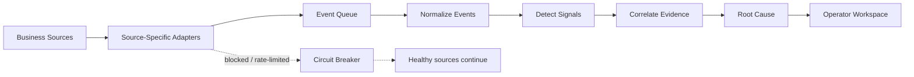
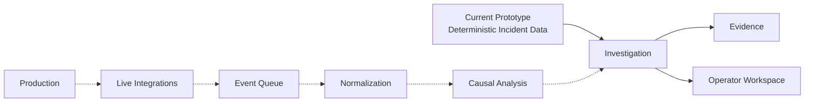
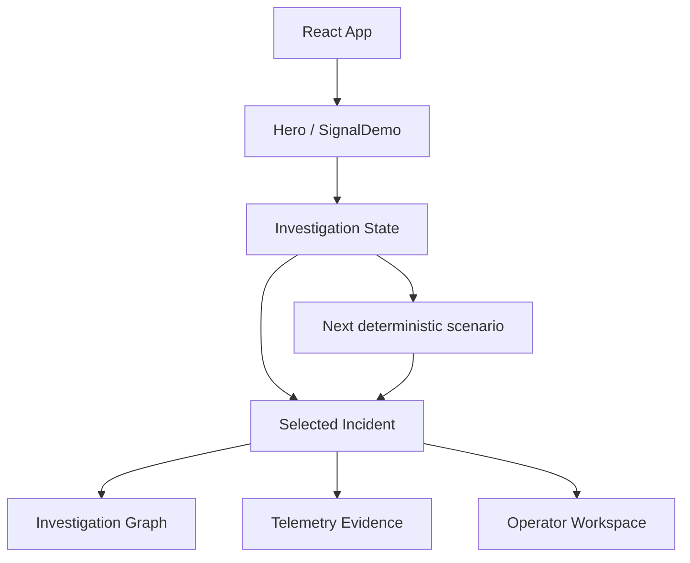

# SIGNAL — Project Decisions

> **Purpose:** One-page decision log and defense sheet for the SIGNAL hiring assignment.

## 1. Product Decision

**SIGNAL** is an AI-powered business intelligence concept designed to reduce dashboard fatigue by connecting fragmented operational signals and surfacing the changes that matter. Instead of presenting another static dashboard, the homepage lets the visitor investigate an anomaly and follow its evidence toward a root-cause thread.

**Core promise:** *See what changed. Know what matters.*

## 2. Assignment Fit

| Requirement | SIGNAL decision |
|---|---|
| Clear hero + CTA | Editorial hero with one primary **Investigate** action |
| Product shown | Interactive investigation engine + Operator Workspace |
| Meaningful motion | Investigation state transitions and restrained micro-interactions |
| 390px / 1440px | Dedicated mobile composition + asymmetric desktop layout |
| Honesty | Demo data is explicitly labeled; no fake logos, testimonials, or user counts |
| Dark mode | Not attempted; the light-first system is intentionally complete |
| Deployment | Vercel-ready static deployment |

## 3. Decision 1 — Ingestion Strategy

### Why this over the obvious alternative?

For the **proposed production system**, we chose **source-specific ingestion adapters behind a decoupled event queue** instead of one generalized ingestion service.

The obvious alternative—a single scraper/webhook processor for every source—was rejected because GitHub, Stripe, Datadog, Sentry, Cloudflare, etc. have different authentication, rate limits, payload schemas, and failure modes. A monolithic processor creates a shared failure domain: a problem in one integration can back-pressure or disrupt the whole pipeline.

Isolated adapters allow independent retries and circuit breakers. If one source is blocked or rate-limited, it is marked degraded while healthy sources continue processing. This reduces blast radius and makes integrations easier to evolve.

## 4. Decision 2 — Time-Limit Trade-off

We deliberately built a **deterministic client-side investigation simulation** instead of a live telemetry ingestion backend.

This kept the limited implementation time focused on what the assignment directly evaluates: product storytelling, interaction quality, responsive composition, accessibility, meaningful motion, and visual polish. The prototype uses four deterministic incident scenarios, with scenario-specific graphs and evidence, rather than pretending to have real production telemetry.

With a real week, I would replace the local incident data with live GitHub/Stripe/Datadog/Sentry adapters, persistent storage and normalization, automated anomaly detection, and the causal-analysis layer behind the same investigation interface.

## 5. Decision 3 — AI Use & Personal Ownership

AI was used as an **implementation accelerator**, not as the source of product decisions.

### AI-assisted
- Vite/Tailwind scaffolding and component boilerplate
- CSS utility combinations
- Framer Motion implementation patterns
- Some accessibility/refactoring suggestions

### Personally decided and verified
- SIGNAL concept, positioning, and **“See what changed. Know what matters.”**
- Interactive investigation as the hero centerpiece
- Light-first editorial visual system
- Restrained motion instead of generic AI visual effects
- Four-scenario deterministic investigation model
- Honest demo-data policy: no fabricated logos, testimonials, or user metrics
- Responsive behavior at 390px and 1440px
- Keyboard/accessibility behavior, state transitions, timer cleanup, and production build

**Ownership principle:** AI accelerated implementation; I made, reviewed, tested, and defended the product decisions.

## 6. Current Prototype Architecture

The investigation is local and deterministic for instant replay and predictable testing. The four scenarios are simulated demonstration data, not live customer telemetry.

## 7. Key Constraints

- No fabricated credibility: customer logos, testimonials, and user counts are not invented.
- Motion must explain product behavior rather than decorate the page.
- Light mode is intentionally complete; no partial dark mode.
- 390px and 1440px are primary acceptance viewports.
- No horizontal-overflow hacks.
- Production architecture is clearly separated from the frontend prototype.

## 8. Verification

The documented QA covers functional investigation/replay, responsive behavior, keyboard/accessibility behavior, hostile interaction cases, timer cleanup, and production build verification. The latest recorded build passed with **0 errors and 0 warnings**.

**Final submission requirement still to verify:** the deployed Vercel URL must be tested at 390px and 1440px before submission.

